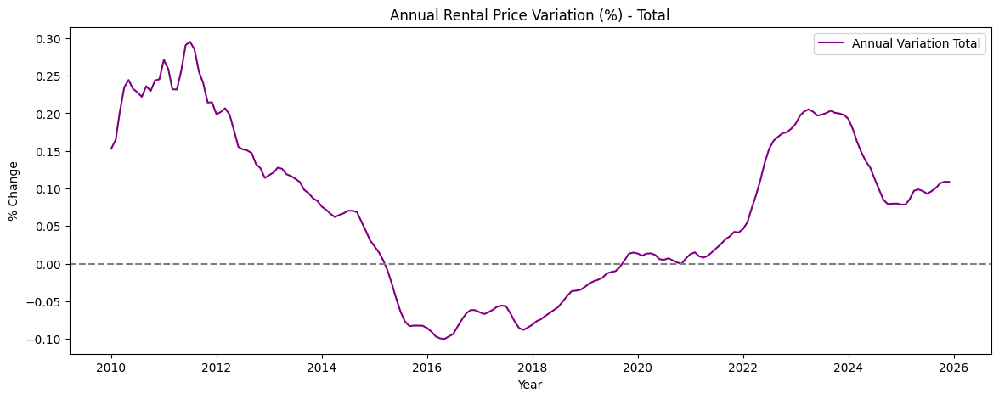
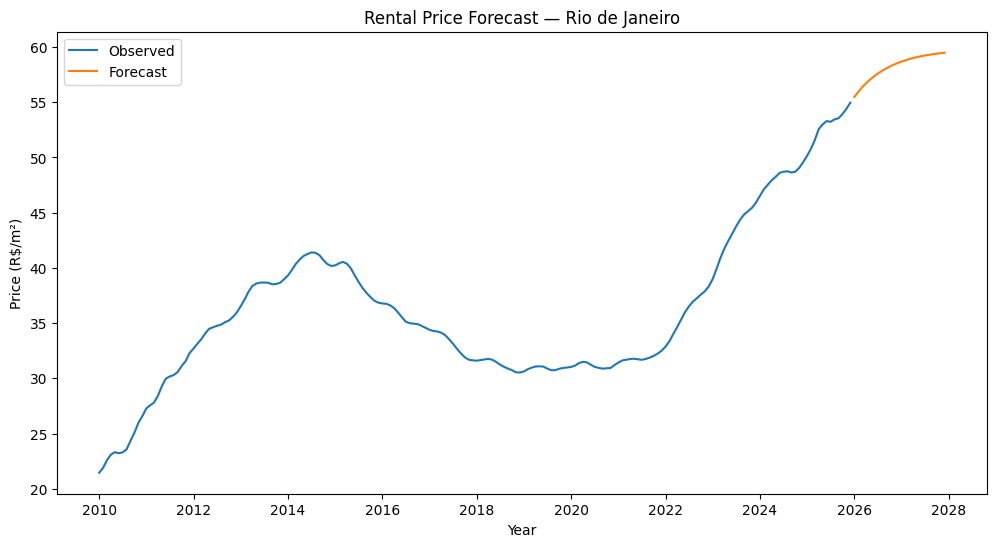

# Predicting Residential Rental Prices in Rio de Janeiro: A Time Series Analysis
*Time-series modeling to understand long-term rental price dynamics and support housing market insights in Rio de Janeiro.*

**Dataset:** 16 years of residential rental data (2010–2025)  
**Techniques:** Exploratory Data Analysis, Time Series Modeling (ARIMA), Trend Analysis  
**Key Result:** ARIMA forecasting suggests rental prices could approach **~R$60/m² by 2027**, continuing the long-term upward trend observed in the data.


---

## Business Context

Housing affordability has become an increasingly discussed issue in major cities around the world, particularly in tourist-driven urban areas.

Cities such as **Barcelona, Medellín and Rio de Janeiro** have experienced strong public debate about the impact of short-term rental platforms like Airbnb on local housing markets. In highly touristic destinations, the conversion of residential units into short-term rentals can reduce long-term housing supply and contribute to rising rental prices. 

Having lived in **Rio de Janeiro** and other global cities, I personally observed how rental prices increased significantly over time, especially in neighborhoods with strong tourism activity. 

This project was initially motivated by the idea of comparing **long-term rental prices with short-term rental platforms such as Airbnb**. Due to data limitations, the analysis instead focuses on understanding the **historical evolution of residential rental prices** and identifying structural trends in the Rio housing market.

Understanding these dynamics is relevant for:

• Residents evaluating housing affordability  
• Real estate investors monitoring long-term trends  
• Urban planners and policymakers assessing housing pressure in tourist cities  

A data-driven analysis helps move beyond anecdotal perception and provides a clearer view of how rental prices evolve over time.

---

## Dataset

Source: FipeZAP Index  
https://www.datazap.com.br/conteudos-fipezap/

The FipeZAP Index is an official indicator that tracks residential real estate prices in Brazil.

For this project, the dataset was filtered to include:

• **City:** Rio de Janeiro  
• **Property type:** residential rental properties  
• **Frequency:** monthly observations  
• **Period:** Jan 2010 – Dec 2025  

The final dataset contains **16 years of rental price data**, which were used for exploratory analysis and time-series forecasting.

---

## Problem Statement

Can historical rental price data be used to identify structural trends and generate reasonable forecasts for residential rent prices in Rio de Janeiro?

---

## Objectives

• Perform structured exploratory analysis of historical rental price data  
• Identify long-term trends and potential seasonal behaviors  
• Apply time-series modeling techniques to forecast rental price evolution  
• Translate statistical findings into market insights  
• Demonstrate how time-series analysis can support real estate market understanding

---

## Methodology

1. **Data Cleaning and Preprocessing**  
Filtering the dataset to include only residential rental listings in Rio de Janeiro and ensuring consistent monthly observations.

2. **Exploratory Data Analysis**  
Identification of price trends, volatility patterns and structural behavior in the rental market.

3. **Time-Series Preparation**  
Aggregation and transformation of data into a monthly time series suitable for forecasting.

4. **Time-Series Modeling**  
Application of ARIMA methods to model historical patterns and estimate future rental price trajectories.

5. **Insight Generation**  
Interpretation of model outputs in the context of urban housing dynamics.

---

## Tools & Technologies

• Python (Pandas, NumPy)  
• Statsmodels (ARIMA)  
• Matplotlib  
• Seaborn  
• Time-Series Analysis Methods

---

## Exploratory Data Analysis Highlights

The exploratory analysis revealed several structural patterns in the rental market:

• **Consistent upward trend:** rental prices increased significantly over the analyzed period, indicating structural pressure in the housing market.

• **Periods of accelerated growth:** certain time windows show sharper price increases, likely linked to macroeconomic cycles and tourism-driven demand.

• **Market volatility:** short-term fluctuations suggest sensitivity to external factors such as economic conditions and housing supply.

• **Macroeconomic shocks:** the series reflects major economic events in Brazil, including the economic slowdown around **2015–2017** and the **COVID-19 pandemic (2020–2021)**, both associated with noticeable shifts in rental price dynamics.

These insights motivated the application of time-series modeling to better understand the evolution of rental prices.



**Figure:** Annual percentage variation in residential rental prices in Rio de Janeiro (2010–2025), highlighting periods of economic slowdown and the COVID-19 shock.

---

## Modeling Approach

This project uses **time-series forecasting techniques** to estimate how rental prices evolve over time.

The modeling strategy focuses on capturing:

• **Trend components**, reflecting long-term growth in housing prices  
• **Seasonality**, potentially linked to tourism cycles and housing demand  
• **Random fluctuations**, representing short-term market variability

ARIMA models were selected due to their strong interpretability and suitability for structured time-series forecasting.

---

## Model Performance

A univariate **ARIMA(1,1,1)** model was used to forecast monthly rental prices based on historical trends.

The estimated parameters were statistically significant:

- **AR(1) coefficient:** 0.89 (p < 0.001)  
- **MA(1) coefficient:** 0.17 (p = 0.018)

These results indicate **strong temporal persistence**, meaning that past price movements strongly influence future values.

Diagnostic tests support the adequacy of the model:

- **Ljung-Box test (p = 0.56):** no significant remaining autocorrelation in residuals  
- Residual analysis suggests that the main temporal structure of the series has been captured

While ARIMA cannot incorporate external economic drivers, the model provides a **stable trend-based projection** of future rental price dynamics.

---

## Forecast Visualization

The following figure compares historical rental prices with the ARIMA-based forecast for the next 24 months.



The forecast suggests that rental prices could approach **~R$60 per square meter by 2027** if the historical trend observed over the last decade continues.

Recent market reports indicate that rental prices in major Brazilian cities already exceed **R$50 per square meter**, suggesting that the model’s projected trajectory remains economically plausible.

---

## Key Insights

The analysis reveals several structural dynamics in the Rio de Janeiro rental market:

• **Persistent price growth:** rental prices increased from roughly **R$22/m² in 2010 to above R$55/m² bt 2025**, indicating strong long-term appreciation.

• **Post-pandemic recovery:** after a visible disruption during **2020–2021**, prices resumed a strong upward trend starting in 2022.

• **Strong temporal persistence:** the ARIMA model confirms that past price movements significantly influence future values, suggesting structural market momentum.

• **Projected growth:** the forecast indicates that rental prices may reach approximately **R$60/m² by 2027** if current trends persist.

• **Structural demand pressure:** smaller units, especially **1-bedroom apartments**, consistently show higher prices per square meter, reflecting strong demand in dense urban areas.

• **Tourism pressure and housing demand:** cities with strong tourism activity, such as Rio de Janeiro, often experience additional pressure on the housing market as short-term rentals compete with long-term residential supply.

---

## Business Impact & Applications

The results of this analysis could support several real-world applications:

**Housing market monitoring**  
Real estate stakeholders can track long-term price dynamics.

**Investment planning**  
Investors may use historical patterns to evaluate market opportunities.

**Urban policy analysis**  
City planners can assess long-term housing affordability pressures.

**Market intelligence**  
Rental platforms and real estate companies can integrate price trend monitoring into strategic decision-making.

---
## Limitations

* The analysis uses a **univariate time-series model (ARIMA)** and does not include external drivers such as interest rates, inflation or macroeconomic indicators.

* Although the project discusses the potential influence of **short-term rental platforms (e.g., Airbnb)**, this factor was not directly modeled due to data availability.

* Structural changes in the housing market may influence future price dynamics beyond historical patterns.

---

## Next Steps

Possible extensions of this project include:

* Incorporating macroeconomic variables (inflation, interest rates)
* Including neighborhood-level segmentation  
* Expanding the model with additional forecasting techniques  
* Building interactive dashboards to monitor rental market dynamics
* Compare long-term rental prices with short-term rental platforms (e.g., Airbnb) to quantify the potential impact of tourism-driven housing demand.

---

## Repository Structure

```
.
├── data
├── notebooks
├── images
├── requirements.txt
└── README.md
```

---

## Strategic Perspective

In this project, I aimed to combine **technical time-series analysis with contextual interpretation of urban housing dynamics**.

My analytical approach is influenced by personal experience living in different cities and countries. Observing how local housing markets evolve helped me question assumptions and connect statistical patterns with real-world context.

This perspective helps translate data analysis into **insights that are meaningful for decision-making**.

---

## Conclusion

This project demonstrates how time-series analysis can help understand long-term housing market dynamics.

Using approximately **15 years of rental data**, the analysis identified a strong upward trend in residential prices in Rio de Janeiro and generated a short-term forecast suggesting continued price growth.

Beyond the forecasting exercise, the project highlights how structured data analysis can transform historical data into insights relevant for **real estate market analysis, urban economics and housing policy discussions**.

